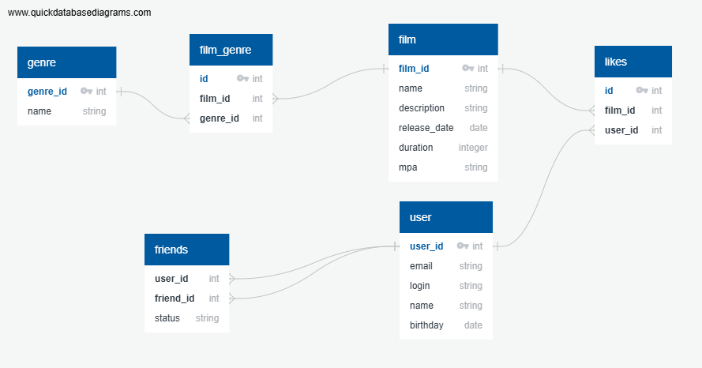

# java-filmorate
Template repository for Filmorate project.

# Описание БД
База данных состоит из 6 таблиц:
- Таблица film с полями: ID фильма (PK), название фильма, описание, дата релиза, длительность, возрастной рейтинг
- Таблица film_genre с полями: ID (PK), ID фильма (FK), ID жанра (FK)
- Таблица genre с полями: ID жанра (PK), название жанра
- Таблица user с полями: ID пользователя (PK), email, логин, имя, дата рождения
- Таблица likes с полями: ID (PK), ID фильма (FK), ID пользователя (FK)
- Таблица friends с полями: ID пользователя (FK), ID друга (FK), статус дружбы

# Примеры запросов

- Запрос на получение всех фильмов:
  SELECT *
  FROM film;

- Запрос на получение всех пользователей:
  SELECT *
  FROM user;

- Запрос на получение N самых популярных фильма:
  SELECT l.film_id,
  f.name,
  COUNT(l.user_id) as count_likes
  FROM likes AS l
  INNER JOIN film AS f ON f.film_id = l.film_id
  GROUP BY film_id
  ORDER BY count_likes DESC
  LIMIT N

- Запрос на получение общих друзей у пользователей A и B:
  SELECT f1.friends_id AS friend_id,
  u.name AS friend_name
  FROM friends f1
  JOIN friends f2 ON f1.friends_id = f2.friends_id
  JOIN user u ON f1.friends_id = u.user_id
  WHERE f1.user_id = A AND f2.user_id = B;

